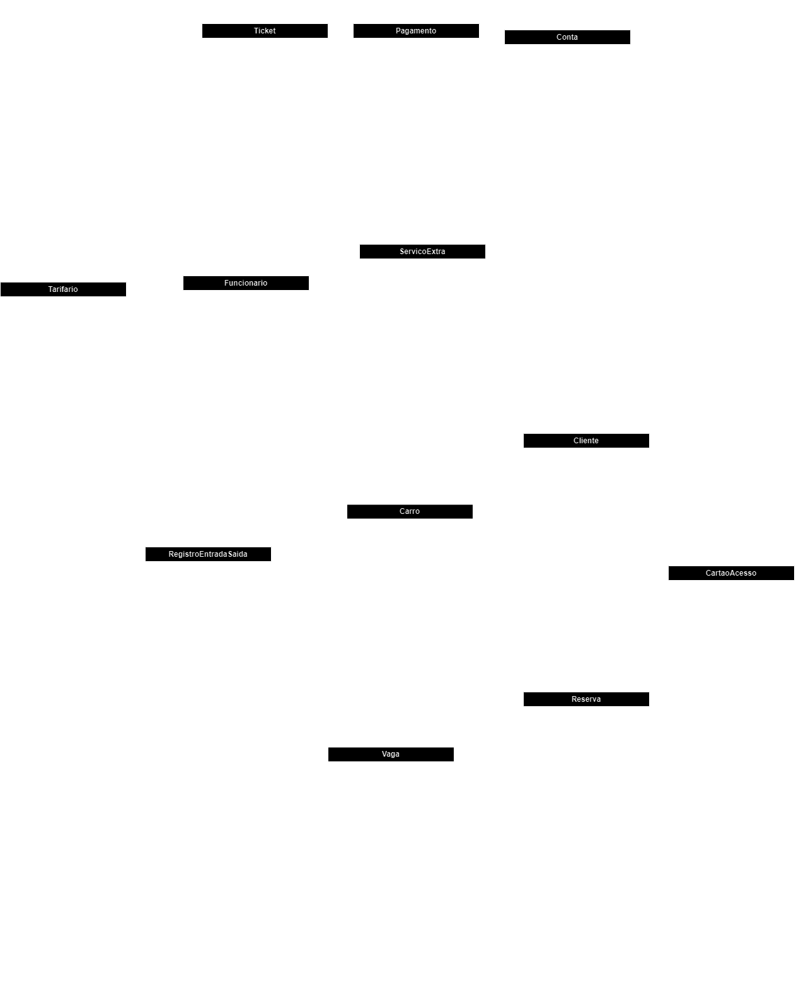

<h1>Documentação do Projeto: Sistema de Gerenciamento de Estacionamento</h1>

<h2>Resumo do Projeto</h2>

Este projeto se refere ao desenvolvimento de uma API em C# que gerencia um estacionamento. 
A API permite a entrada e saída de veículos, registrando as informações relevantes, como data e hora de entrada e saída, placa do carro, 
vaga ocupada e outras informações relacionadas.
Além disso, a API também oferece funcionalidades adicionais, como o registro de serviços extras, 
criação de contas para clientes e o cálculo de tickets de pagamento com base nas estadias dos veículos e serviços adicionais.

<h3>Principais Funcionalidades</h3>

<h4>Gerenciamento de Estacionamento</h4>
<ul>
    <li>Registro de entrada de veículos no estacionamento, com informações como placa, vaga ocupada e data/hora de entrada.</li>
    <li>Registro de saída de veículos do estacionamento, com cálculo automático do valor total a ser pago com base na estadia.</li>
    <li>Verificação se um veículo está presente no estacionamento antes de registrar sua saída.</li>
</ul>
<h4>Serviços Extras</h4>
<ul>
    <li>Registro de serviços extras realizados para os clientes.</li>
    <li>Associação de serviços extras a um cliente, carro e funcionário responsável.</li>
</ul>

<h4>Contas de Clientes</h4>
<ul>
    <li>Criação de contas para clientes.</li>
    <li>Registro de gastos totais nas contas dos clientes.</li>
    <li>Consulta das contas dos clientes, incluindo seus gastos totais.</li>
</ul>

<h4>Tickets de Pagamento</h4>
<ul>
    <li>Criação de tickets de pagamento com base na estadia do veículo e serviços extras realizados.</li>
    <li>Cálculo automático do valor total a ser pago no ticket.</li>
    <li>Associação de tickets a clientes e veículos.</li>
</ul>

<h4>Pagamento e Atualização de Contas</h4>
<ul>
    <li>Ao realizar o pagamento de um ticket, as informações da conta do cliente são atualizadas automaticamente para refletir o valor pago.</li>
    <li>O valor total do ticket é registrado na conta do cliente como um gasto adicional.</li>
    <li>Se serviços extras estiverem associados ao ticket, o valor total desses serviços é adicionado ao gasto total na conta do cliente.</li>
    <li>O registro do pagamento do ticket é criado, incluindo a data e hora do pagamento, valor pago e referência ao ticket correspondente.</li>
</ul>

Essas funcionalidades foram implementadas para garantir que as contas dos clientes sejam atualizadas com precisão após o pagamento de um ticket e a inclusão de serviços extras.

    
<h2>Diagrama UML</h2>

	
<h2>Relatório de Atividades Desenvolvidas com Auxílio do ChatGPT</h2>

O desenvolvimento deste projeto envolveu várias etapas, desde a criação do modelo de dados até a implementação das rotas da API. 
O ChatGPT foi utilizado para fornecer assistência em várias partes do processo de desenvolvimento, incluindo:

<ol>
    <li><h6>Criação do Modelo de Dados:</h6> O ChatGPT auxiliou na definição das classes e relacionamentos do modelo de dados, garantindo que as tabelas do banco de dados fossem projetadas de maneira eficiente para suportar as funcionalidades necessárias.</li>
    <li><h6>Implementação das Controllers:</h6> O ChatGPT forneceu orientações sobre a implementação das controllers, incluindo a definição das rotas, validações necessárias, tratamento de erros e inclusão de mensagens de resposta adequadas.</li>
    <li><h6>Integração com o Banco de Dados:</h6> O ChatGPT ajudou na integração da API com o banco de dados, garantindo que as consultas fossem eficientes e que os relacionamentos entre as tabelas fossem tratados corretamente.</li>
    <li><h6>Lógica de Negócios:</h6> O ChatGPT contribuiu para o desenvolvimento da lógica de negócios, como o cálculo do valor total a ser pago nos tickets de pagamento com base nas estadias dos veículos e serviços extras.</li>
    <li><h6>Documentação do Projeto:</h6> Esta documentação foi gerada com a ajuda do ChatGPT, resumindo o escopo do projeto, listando as principais funcionalidades e descrevendo como o ChatGPT auxiliou em várias etapas do desenvolvimento.</li>
</ol>

Em resumo, o ChatGPT desempenhou um papel significativo no desenvolvimento deste projeto, fornecendo assistência valiosa em várias áreas, desde o design do banco de dados até a implementação das funcionalidades da API. Isso ajudou a acelerar o desenvolvimento e garantir a qualidade do código produzido.
